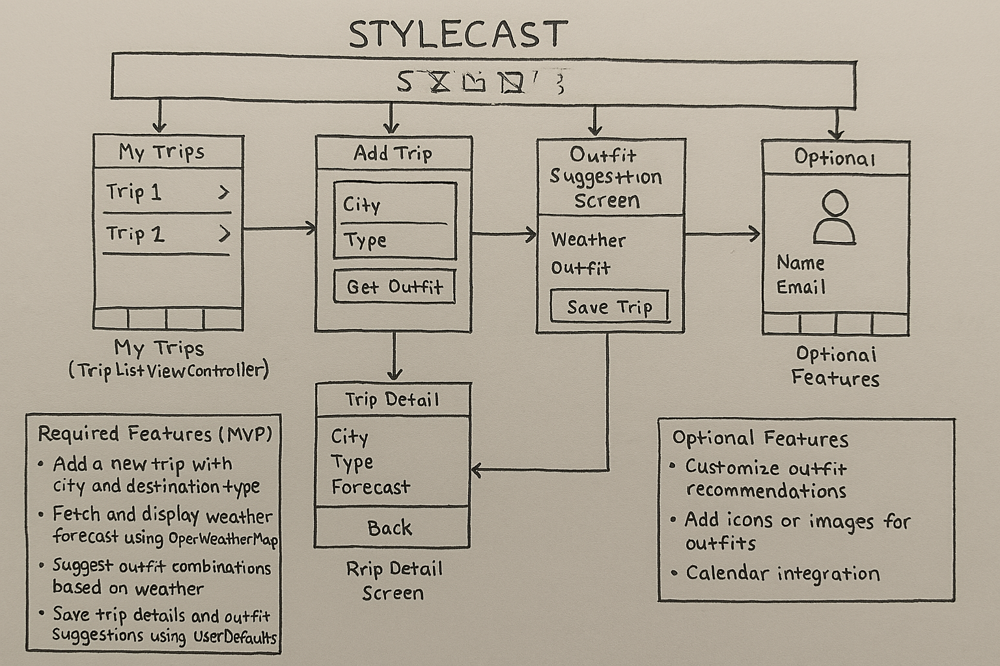

# StyleCast

## Table of Contents
[Overview](#Overview)
[Product Spec](#Prodcuct-Spec)
[Wireframes](#Wireframes)
[Schema](#Schema)
[Demo](#Demo)
[Progress Update](#Progress-Update)

---

## Overview

### Description
StyleCast is a travel outfit planning app that helps users decide what to pack and wear based on the weather forecast at their destination. Users can input a city and destination type, receive real-time weather forecasts via the OpenWeatherMap API, and get personalized outfit suggestions. Trips and suggestions are saved locally, and users can view them later through the Trips tab. The app includes a tabbed interface for quick navigation between Trips, Add Trip, and Profile.

### App Evaluation

| Attribute | Description |
|-----------|-------------|
| **Category** | Travel / Fashion |
| **Mobile** | Makes use of tab navigation, API integration, local data storage, and contextual weather-based features |
| **Story** | Helps travelers plan appropriate outfits based on weather — something people actually worry about before trips |
| **Market** | Ideal for students, fashion-conscious travelers, influencers, and organized planners |
| **Habit** | Used at the start of each trip, and repeatedly for frequent travelers |
| **Scope** | MVP is clearly defined and manageable, and optional features like profile customization and outfit editing are great for expansion |

---

## Product Spec

### 1. User Stories

#### Required Must-have Stories
- User can add a new trip by entering a city and selecting a destination type
- User can fetch the current weather for the city using OpenWeatherMap API
- User receives recommended outfit suggestions based on weather
- User can save the trip and outfit recommendation locally (UserDefaults)
- User can view a list of saved trips in a TableView

#### Optional Nice-to-have Stories
- User can customize or edit outfit recommendations before saving
- User can view weather-related outfit icons or images
- User can pick a trip date using a calendar
- User can edit name/email on a Profile tab
- User can delete or re-plan existing trips

---

### 2. Screen Archetypes

- **Trip List Screen**
  - User can view all saved trips with location, destination type, weather, and outfit details

- **Add Trip Screen**
  - User can enter a city and select destination type using segmented control

- **Weather & Outfit Suggestion Screen**
  - User can view weather forecast and receive tailored outfit ideas

- **Trip Detail Screen**
  - User can see full trip details including outfit breakdown

- **User Profile Screen**
  - User can view/edit their profile info (name, email), saved using UserDefaults

---

### 3. Navigation

#### Tab Navigation (Tab to Screen)
- **My Trips** → Trip List Screen  
- **Add Trip** → Add Trip Screen  
- **Profile** → User Profile Screen  

#### Flow Navigation (Screen to Screen)
- **Add Trip** → Weather & Outfit Suggestion Screen → Save Trip → Return to Trips
- **My Trips** → Trip Detail Screen

---
## Wireframes

### Hand-drawn Wireframes

This wireframe shows the full navigation and feature layout of the StyleCast app. It includes:
- Tab bar navigation between My Trips, Add Trip, and Profile
- Flow between Add Trip → Outfit Suggestion → Save Trip
- Detailed trip info screen and feature checklist

---

## Demo

Watch the Week 11 Demo:

  <a href="https://www.loom.com/share/38de962ac7244ac8af96f74f85d90ef3">
    
StyleCast – Week 11 Demo

  </a>
  

---

## Progress Update (Week 11)

### Completed
- [x] Created Xcode project with Storyboard
- [x] Wireframe images upload
- [x] Implemented Tab Bar with three screens (Trips, Add Trip, Profile)
- [x] Created TripListViewController with mock data
- [x] Connected Storyboard UI elements to Swift code

### In Progress
- [ ] API integration with OpenWeatherMap
- [ ] Outfit suggestion logic
- [ ] Save/load trips using UserDefaults
- [ ] 

